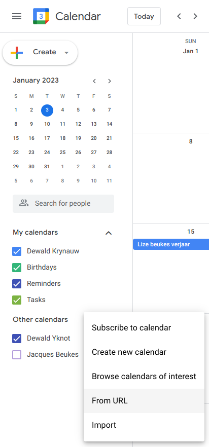

# Crew & Contractors

### Structure

The basic company structure is composed out of both full-time, and part-time employees. We know blockchian development is a super interesting field to learn and we create space for a selected few to join us on our journey to become and to build the best. The full-time crew consists of the following legends:

**Core Team**

Within this team, we have a core team taking responsibility for business functions. Here's a quick list of who to contact for what:

1. Anika - UX/UI & graphic design, marketing, Designs, Client Relationships, Team Connection, new crew, skills development, salaries & invoices
2. Jacques - Technology Decisions, Development Planning, Development Processes
3. Dewald - Information Management, Critical Systems, Reusability of Code, Security & Data Protection, System Maintenance & Support
4. Gideon - Resource Planning, Proposals, Project Management, Finances&#x20;

### Connection

Our team connection and relationships are crucial to being a successful development company. We believe that every individual has God-given talents and skills that they need to bring to the table. We encourage every team member to bring themselves to the party so the team doesn't lack in any way.&#x20;

We work in a fully remote environment and trust one another to do what is best for the company, and manage themselves well. We prioritise 2-weekly in-person gatherings in Pretoria to work, eat and exercise together. It is important that we all look after ourselves, and after one another, to run as far as we are able to fnish the race entrusted to us. So be you, and do it freely. Bring all you have to offer. Who knows...we might sail to the ends of the Earth.

### ⚓ All hands on Deck

We always have a bunch of cool contractors on board. You will often work in a team consisting of crew and contractors. Teams are always changing like the currents on the oceans. We invite you to hang with us on our 🍹[#upper-deck](https://discord.gg/GNmzHygT) on Discord.

The contractor team is as ever-changing, as the tides in the seven seas. We try to make space for anybody willing and able to join the team in any capacity that they are able to add value in.
