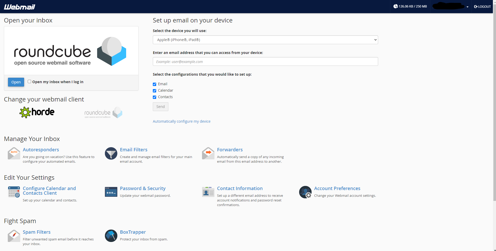
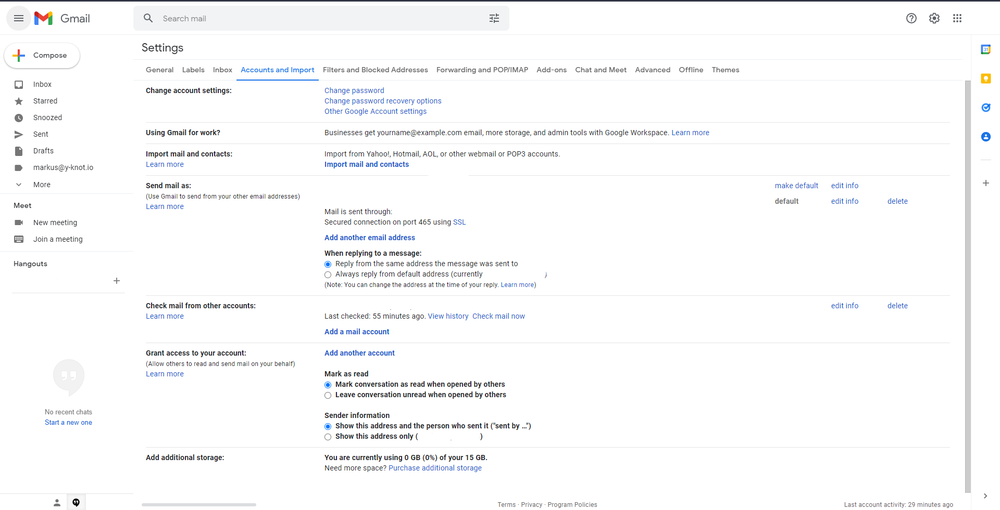
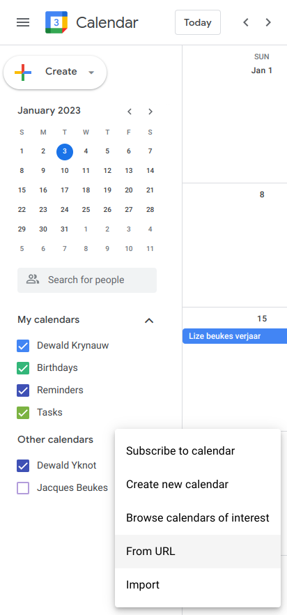

# 📧 Email Setup

## Creating Company Email and Password

This guide will help you set up your company email account so that you can use Gmail (or any other email service) to send and receive emails.

> When your Y-knot email is created, a few automated messages will be sent to your pre-specified email address. One of the emails that you have received will let you set a password for the **new account**, and the other email contains the client configuration settings for your new account.

* You first want to pick a password for your new account by clicking on the link provided by the first email from CPanel. (If the link from CPanel expires, you can navigate to [this link](https://y-knot.io:2083/) and use the **Forget Password** option)
* Once you have chosen a password for your y-knot email, following the steps on [this link](https://hollypryce.com/cpanel-gmail/), up until the following header: **4. Authenticate your email address**. The instructions in this section will not be required for you to do.
* After you have completed the steps outlined in the link above, there are a few changes you should make on both your CPanel webclient and Gmail.

***

Should you need to, you can navigate to your CPanel webclient. You can do this by clicking on [this link](https://y-knot.io:2083/). Enter the username (it will be your new email address) and the password that you have specified. If the login was successful, you should see a screen that looks like this:

***

## Linking email to Gmail


This example is for gmail. But the same process should apply to Outlook, etc..\
However Windows Mail, seems to have issues doing the following.


* To do this, log into your previous created Gmail account, and click on the **Settings** cog button at the top right of the screen. Then click on **See all settings**.
* This should open the Settings page with multiple tabs at the top. Click on the **Accouts and Imports** tab.

* In the **Send mail as:** section, click **Add another email address** and add the info as provided in the cpanel setup email.
* In the **Check mail** section, click **Add another account**, similarly add the info as in the email.

## Calendar Setup

To add you y-knot calendar to your gmail account.

Go to your cpanel and click on the **Configure Calendar** section, you should see the following

<figure><figcaption></figcaption></figure>

Copy the calendar url at the bottom of the page and go to your google calendar. Navigate to the other calendar import from URL, and paste the previous URL. You should now have your Yknot calendar synced with your gmail account.

All these steps should successfully set up your Y-knot account to work synchronously with Gmail.
