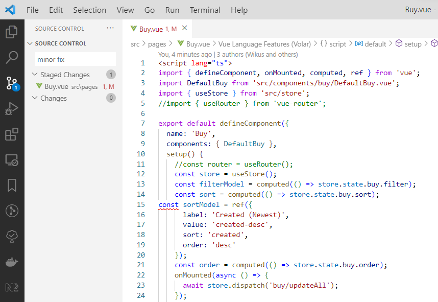
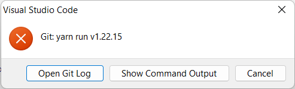

# Husky

Husky helps to improve your git commits by running checks before a commit is made. 

## ESLint VS Code example

Here we are trying to commit a change that does not follow the eslint rules that we setup for this project. (See line 15 in the image below.)



When we commit, Husky runs `yarn run eslint` (specified in `./.husky/pre-commit`), which gives the following error message:



The Git Logs are something like:

```
> git -c user.useConfigOnly=true commit --quiet --allow-empty-message --file -
yarn run v1.22.15
$ eslint --ext .js,.ts,.vue ./

C:\<project dir>\src\pages\Buy.vue
  15:1  error  Insert `····`  prettier/prettier

✖ 1 problem (1 error, 0 warnings)
  1 error and 0 warnings potentially fixable with the `--fix` option.

error Command failed with exit code 1.
info Visit https://yarnpkg.com/en/docs/cli/run for documentation about this command.
husky - pre-commit hook exited with code 1 (error)

```

The important part of the logs is the error message, which tells us what is wrong and how to fix it:
```
C:\<project dir>\src\pages\Buy.vue
  15:1  error  Insert `····`  prettier/prettier
```

--- 

Learn more about Husky on their [home page](https://typicode.github.io/husky/#/).